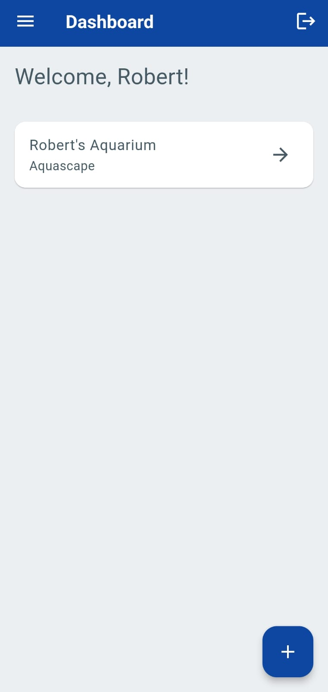
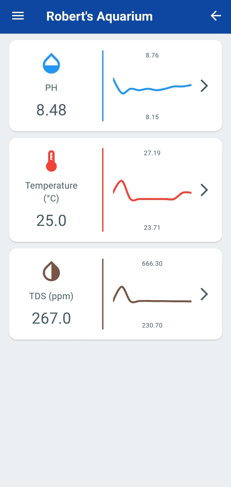
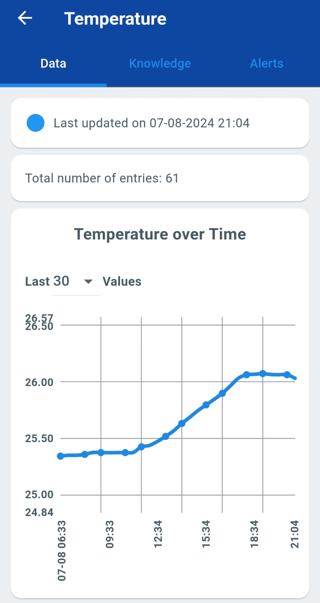
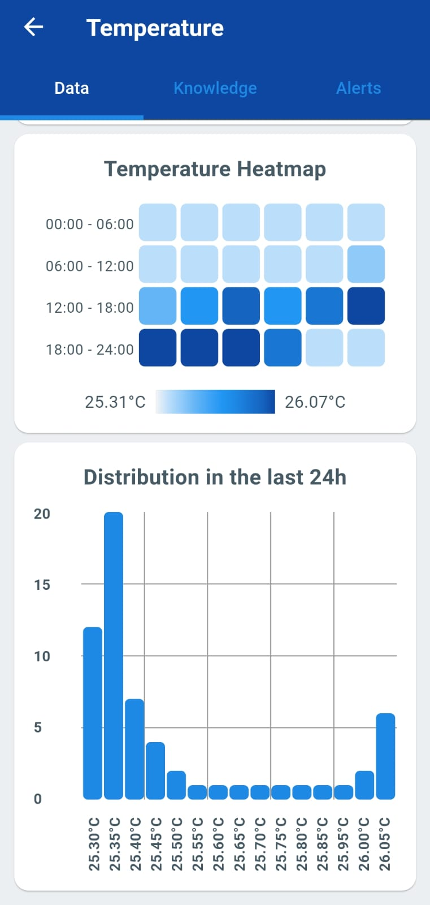
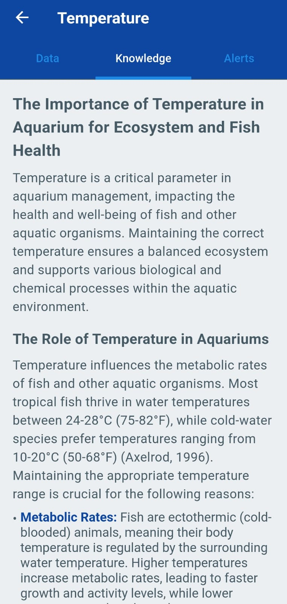
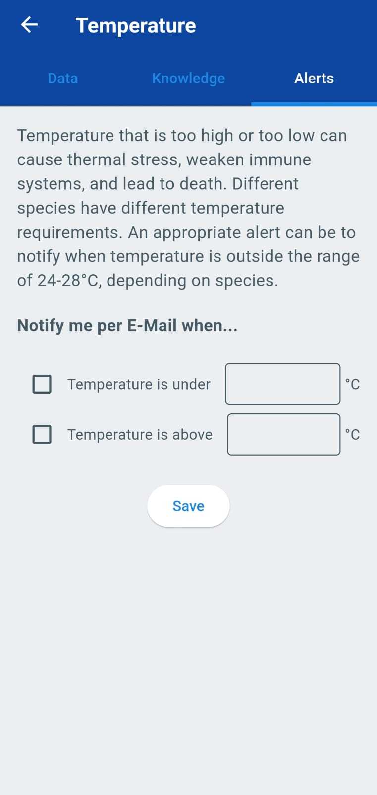

# 📱 Aquaware Mobile App

The Aquaware mobile app is your go-to tool for managing and monitoring the water quality of your aquariums. Designed with user-friendliness in mind, the app allows you to easily upload water quality measurements, view historical data, and get insights on the health of your aquatic environment—all from the convenience of your smartphone.

### Key Features:
- **Historical Data View**: Track your water quality trends over time with interactive charts and graphs.
- **Alerts and Notifications**: Set custom alerts for critical water parameters, and receive notifications when your aquarium needs attention.

### Free to Use, With Advanced Features Coming Soon

Aquaware's core functionality—monitoring and managing your aquarium’s water quality—is free to use. You can upload and track your water values without any cost. In the near future, we will introduce advanced analytics and AI-driven predictions that will help you optimize your aquarium's conditions even further. These premium features will be available as part of a subscription service, ensuring that you have access to the most cutting-edge tools for aquarium management.

### 📷 App Screenshots

Here are a few glimpses of what you can do with the Aquaware app:

## **Dashboard Overview**  

Get a comprehensive overview of your aquariums, including the latest measurements and alerts.

 

## **Data Visualization**  

Dive into detailed data visualizations to understand your aquarium's water quality at a glance.

 

## **Knowledge Source**
   
Learn more about the importance of each parameter and how it impacts the aquatic environment.
    

## **Alert Notifications**

Receive timely alerts when your water parameters go out of the desired range.

