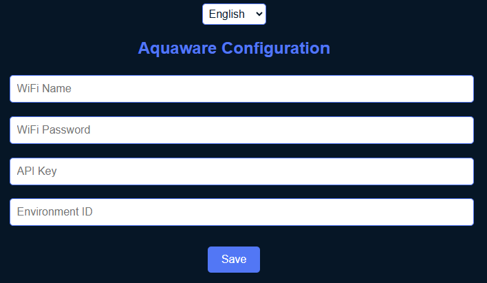

# Setting Up Your Aquaware Hardware Kit  

Congratulations! Your Aquaware hardware kit is ready for setup. In just a few simple steps, you can start monitoring your water quality.  

## 1. Prepare the Hardware  

Submerge the sensors in water and connect the hardware kit to a power source via USB. After a short time, a Wi-Fi network named **"Aquaware_Setup"** will appear.  

Connect to this network – the default password is **"12345678"**.  

## 2. Connecting & Configuration  

Once connected, a configuration page should open automatically. If it does not, you can manually access it via **"http://192.168.4.1"**.  

  

You will need to enter the following information:  

- **WIFI Name** – The name of your Wi-Fi network that the device should connect to.  
- **WIFI Password** – The password for your Wi-Fi network.  
- **API Key** – You can find this after registering in your [Aquaware Dashboard](https://dashboard.aquaware.cloud/account) under **Account Settings**. Copy the API key and paste it here.  
- **Environment ID** – This can be found under [Environments](https://dashboard.aquaware.cloud/environments) in your dashboard. If you have already created an aquarium, you will see an ID (a number) above its name. Enter this number here.  

Once all fields are filled in, click **"Save"**.  

## 3. You're all set!  

If all information is correct, the sensor will now automatically send your water data to Aquaware.  

🎉 Great! You're done! Now you can monitor your water values anytime using our official app.
