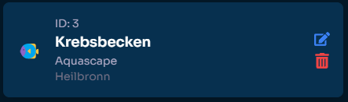

# Create an Environment

## What is an Environment?

In **Aquaware**, an environment represents a water system or setting you want to monitor. Examples of environments include aquariums, lakes, pools, seas, or even ponds. Each environment stores essential data such as water parameters and metadata, enabling you to keep track of its condition and make data-driven decisions.

---

## How to Create an Environment

Creating an environment is simple. Follow these steps:

1. Navigate to the **Environment** page in the dashboard.
2. Click the **"Create New Environment"** button.

   

3. Fill in the form with the following details:

   - **Name**: A descriptive name for your environment.
   - **Description**: Add additional information about the environment (e.g., its purpose, unique details).
   - **Type**: Select the environment type (e.g., aquarium, lake, pool, etc.).
   - **City**: (Optional) Mention the city where the environment is located.

4. Click the **"Create"** button to save your environment. Once created, it will appear in your list of environments.

---

## Editing an Environment

If you want to update details about an environment, follow these steps:

1. Locate the environment in your list.
2. Click the **Edit Icon** (✏️).

   

3. A dialog box will appear where you can modify any of the environment's fields.
4. After making changes, click the **"Update"** button to save.

---

## Deleting an Environment

If you no longer need an environment, you can delete it:

1. Click the **Delete Icon** (🗑️) next to the environment.

   

2. A confirmation dialog will appear. You will need to type the name of the environment to confirm the deletion.
3. Click **"Delete"** to permanently remove the environment.

> **Note**: Deleted environments cannot be recovered.

---

## Understanding the Environment ID

Each environment you create has a unique **ID**. This ID is used to identify the environment across Aquaware's systems. It’s especially important if you’re using the API to upload water values or automate processes. The ID can be found in the environment card under "ID."

---

:::note[Keep in mind]
There is no limit to the amount of environments but the amount of which you can upload to is set to your plan's limit
:::

Let's now look into how we can start adding our water values to aquaware.
