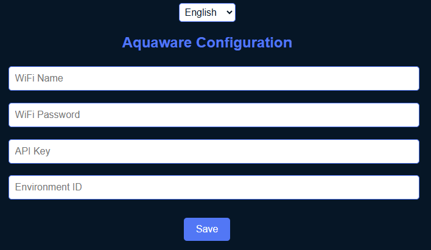

# Dein Aquaware Hardware-Kit einrichten  

Herzlichen Glückwunsch! Dein Aquaware Hardware-Kit ist bereit für die erste Einrichtung. Mit nur wenigen Schritten kannst du deine Wasserqualität überwachen.  

## 1. Hardware vorbereiten  

Stecke die Sensoren ins Wasser und schließe das Hardware-Kit über den USB-Anschluss an eine Stromquelle an. Nach kurzer Zeit wird ein WLAN mit dem Namen **"Aquaware_Setup"** sichtbar.  

Verbinde dich mit diesem Netzwerk – das Standardpasswort lautet **"12345678"**.  

## 2. Verbindung & Konfiguration  

Sobald du verbunden bist, sollte sich automatisch eine Konfigurationsseite öffnen. Falls dies nicht geschieht, kannst du die Seite manuell unter **"http://192.168.4.1"** aufrufen.  

  

Hier werden einige wichtige Informationen benötigt:  

- **WIFI Name** – Der Name deines WLAN-Netzwerks, mit dem sich das Gerät verbinden soll.  
- **WIFI Passwort** – Das Passwort für dein WLAN-Netzwerk.  
- **API Key** – Diesen findest du nach der Registrierung in deinem [Aquaware Dashboard](https://dashboard.aquaware.cloud/account) unter **Kontoeinstellungen**. Kopiere den API Key und füge ihn hier ein.  
- **Environment ID** – Diese findest du in deinem [Dashboard unter Umgebungen](https://dashboard.aquaware.cloud/environments). Falls du bereits ein Aquarium angelegt hast, siehst du über dessen Namen eine ID (eine Zahl). Diese muss hier eingetragen werden.  

Nachdem du alle Felder ausgefüllt hast, klicke auf **"Speichern"**.  

## 3. Los geht’s!  

Wenn alle Eingaben korrekt sind, wird der Sensor nun automatisch deine Wasserwerte an Aquaware senden.  

🎉 Perfekt, du bist fertig! Jetzt kannst du deine Wasserwerte jederzeit über unsere offizielle App überwachen.
