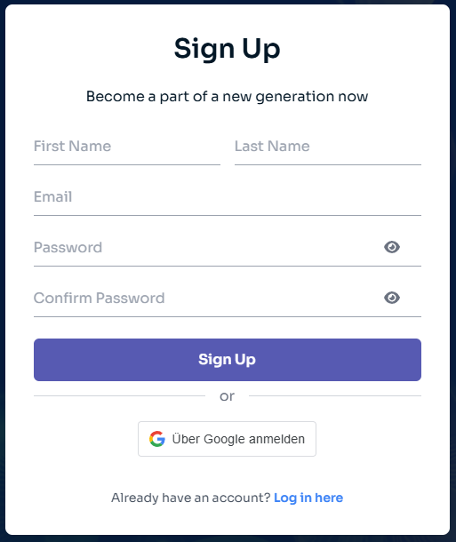

# Konto erstellen

Willkommen bei Aquaware! Die Erstellung eines Kontos ist der erste Schritt, um das volle Potenzial unserer Plattform zu nutzen. Folge dieser Anleitung, um dein Konto schnell und sicher einzurichten.

## So meldest du dich an

1. Gehe zur [Registrierungsseite](https://www.dashboard.aquaware.cloud/signup/).
2. Fülle die folgenden Felder aus:

   - **Vorname**: Gib deinen Vornamen ein.
   - **Nachname**: Gib deinen Nachnamen ein.
   - **E-Mail**: Gib eine gültige E-Mail-Adresse an, auf die du Zugriff hast.
   - **Passwort**: Erstelle ein sicheres Passwort.
   - **Passwort bestätigen**: Gib dein Passwort erneut ein, um es zu bestätigen.

3. Klicke auf die Schaltfläche **Registrieren**.

Alternativ kannst du dich mit deinem Google-Konto anmelden, indem du auf die Schaltfläche **"Mit Google registrieren"** klickst.

Unten siehst du, wie das Registrierungsformular aussieht:

## Anforderungen an das Passwort

Damit dein Konto sicher bleibt, sollte dein Passwort folgende Kriterien erfüllen:

- Mindestens 8 Zeichen lang.
- Mindestens einen Großbuchstaben enthalten.
- Mindestens eine Zahl enthalten (z. B. 0–9).
- Mindestens ein Sonderzeichen enthalten (z. B. `@`, `#`, `$`).

Diese Anforderungen sorgen dafür, dass dein Konto sicher bleibt.

## Datenschutz ist uns wichtig

Wir legen großen Wert auf deine Privatsphäre und Sicherheit:

- **Deine persönlichen Daten werden niemals an Dritte weitergegeben.**
- **Passwörter werden sicher mit modernen Verschlüsselungstechniken gespeichert** und können von niemandem gelesen oder eingesehen werden.

Wenn du Fragen hast oder Probleme bei der Registrierung auftreten, wende dich an unser Support-Team unter [info@kesslermatics.com](mailto:info@kesslermatics.com).

---

Nachdem du dein Konto erstellt hast, erkunde dein Dashboard.
