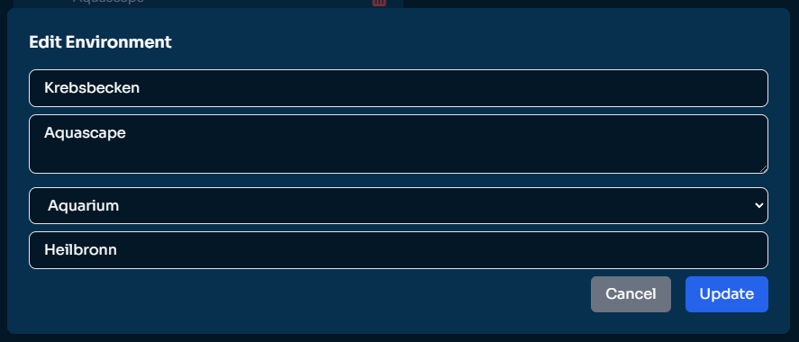
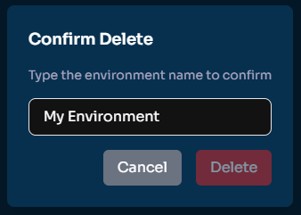
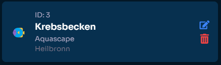

# Eine Umgebung erstellen

## Was ist eine Umgebung?

In **Aquaware** steht eine Umgebung für ein Wassersystem oder einen Bereich, den du überwachen möchtest. Beispiele für Umgebungen sind Aquarien, Seen, Pools, Meere oder sogar Teiche. Jede Umgebung speichert wichtige Daten wie Wasserparameter und Metadaten, sodass du den Zustand im Blick behalten und datenbasierte Entscheidungen treffen kannst.

---

## So erstellst du eine Umgebung

Das Erstellen einer Umgebung ist einfach. Folge diesen Schritten:

1. Gehe zur **Umgebungsseite** im Dashboard.
2. Klicke auf die Schaltfläche **"Neue Umgebung erstellen"**.

   

3. Fülle das Formular mit den folgenden Angaben aus:

   - **Name**: Ein beschreibender Name für deine Umgebung.
   - **Beschreibung**: Zusätzliche Informationen über die Umgebung (z. B. Zweck, Besonderheiten).
   - **Typ**: Wähle den Typ der Umgebung (z. B. Aquarium, See, Pool, etc.).
   - **Stadt**: (Optional) Gib die Stadt an, in der sich die Umgebung befindet.

4. Klicke auf die Schaltfläche **"Erstellen"**, um die Umgebung zu speichern. Nach der Erstellung erscheint sie in deiner Liste.

---

## Eine Umgebung bearbeiten

Wenn du Details einer Umgebung ändern möchtest, folge diesen Schritten:

1. Suche die Umgebung in deiner Liste.
2. Klicke auf das **Bearbeiten-Symbol** (✏️).

   

3. Es erscheint ein Dialog, in dem du alle Felder ändern kannst.
4. Klicke auf **"Aktualisieren"**, um die Änderungen zu speichern.

---

## Eine Umgebung löschen

Wenn du eine Umgebung nicht mehr benötigst, kannst du sie löschen:

1. Klicke auf das **Löschen-Symbol** (🗑️) neben der Umgebung.

   

2. Ein Bestätigungsdialog erscheint. Gib den Namen der Umgebung ein, um die Löschung zu bestätigen.
3. Klicke auf **"Löschen"**, um die Umgebung endgültig zu entfernen.

> **Hinweis**: Gelöschte Umgebungen können nicht wiederhergestellt werden.

---

## Die Umgebungs-ID verstehen

Jede Umgebung hat eine eindeutige **ID**. Diese ID wird verwendet, um die Umgebung in den Aquaware-Systemen zu identifizieren. Sie ist besonders wichtig, wenn du die API nutzt, um Wasserwerte hochzuladen oder Prozesse zu automatisieren. Die ID findest du auf der Umgebungskarte unter "ID".

---

:::note[Wichtig]
Es gibt keine Begrenzung für die Anzahl der Umgebungen, aber die Anzahl der Uploads ist abhängig von deinem Plan.
:::

Schauen wir uns nun an, wie wir Wasserwerte zu Aquaware hinzufügen können.
